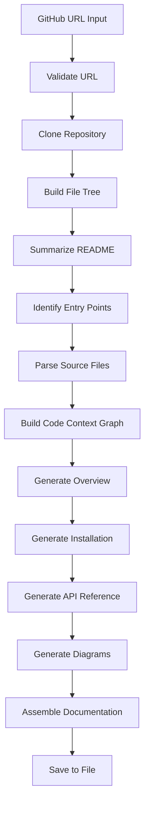
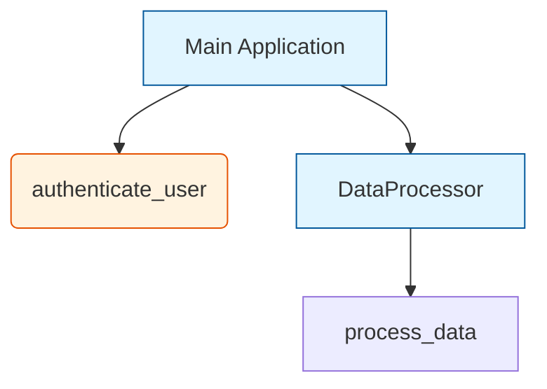

# 📚 Codebase Genius

**An AI-Powered Multi-Agent System for Automated Code Documentation**

Codebase Genius is an intelligent, autonomous system that generates comprehensive, high-quality documentation for any software repository. Built with JacLang and powered by Google's Gemini AI, it analyzes codebases, understands relationships, and produces professional markdown documentation with architecture diagrams.


---

## 🌟 Features

- **🤖 Multi-Agent Architecture**: Specialized agents for mapping, analysis, and documentation
- **🔍 Intelligent Code Analysis**: Parses Python and Jac files to extract functions, classes, and relationships
- **📊 Code Context Graphs**: Visual representation of code structure and dependencies
- **🎨 Architecture Diagrams**: Auto-generated Mermaid diagrams
- **📝 Comprehensive Documentation**: Professional markdown with overview, installation, and API reference
- **🚀 Easy to Use**: Simple API and beautiful Streamlit interface
- **🌐 GitHub Integration**: Clone and analyze any public repository

---

## 🏗️ Architecture

Codebase Genius uses a multi-agent pipeline with four specialized agents:

### 1. **Code Genius (Supervisor)**
- Orchestrates the entire workflow
- Validates inputs and manages agent coordination
- Aggregates results and handles errors

### 2. **Repo Mapper**
- Clones GitHub repositories
- Builds hierarchical file trees
- Identifies and summarizes README files
- Determines entry point files

### 3. **Code Analyzer**
- Parses source files using AST (Python) and regex (Jac)
- Extracts functions, classes, methods, walkers, and nodes
- Builds Code Context Graph (CCG) showing relationships
- Identifies dependencies and call hierarchies

### 4. **DocGenie**
- Generates project overview sections
- Creates installation instructions
- Produces detailed API reference
- Generates Mermaid architecture diagrams
- Assembles complete markdown documentation

---

## 🚀 Quick Start

### Prerequisites

- Python 3.8 or higher
- Git installed and accessible from command line
- Gemini API key

### Installation

1. **Clone the repository**
   ```bash
   git clone https://github.com/Harshpal01/codebase-genius.git
   cd codebase-genius
   ```

2. **Set up the backend**
   ```bash
   cd backend
   python -m venv venv
   
   # On Windows
   venv\Scripts\activate
   
   # On macOS/Linux
   source venv/bin/activate
   
   pip install -r requirements.txt
   ```

3. **Configure environment variables**
   ```bash
   cp .env.example .env
   # Edit .env and add your Gemini_API_KEY
   ```

4. **Start the backend server**
   ```bash
   jac serve main.jac
   ```
   
   The server will start at `http://localhost:8000`

5. **Set up the frontend (optional)**
   
   Open a new terminal:
   ```bash
   cd frontend
   pip install -r requirements.txt
   streamlit run app.py
   ```
   
   The UI will open at `http://localhost:8501`

---

## 📖 Usage

### Using the API

#### Generate Documentation

```bash
curl -X POST http://localhost:8000/walker/code_genius \
  -H "Content-Type: application/json" \
  -d '{"github_url": "https://github.com/username/repository"}'
```

**Response:**
```json
{
  "reports": [
    {
      "status": "completed",
      "repository": "repository",
      "documentation_path": "outputs/repository/docs.md",
      "message": "Documentation generated successfully"
    }
  ]
}
```

#### View Documentation

```bash
curl -X POST http://localhost:8000/walker/get_documentation \
  -H "Content-Type: application/json" \
  -d '{"repo_name": "repository"}'
```

#### List All Repositories

```bash
curl -X POST http://localhost:8000/walker/list_repositories \
  -H "Content-Type: application/json"
```

### Using the Streamlit UI

1. Open `http://localhost:8501` in your browser
2. Navigate to the "Generate Documentation" tab
3. Enter a GitHub repository URL
4. Click "Generate Docs"
5. Wait for processing (may take a few minutes)
6. View the generated documentation in the "View Documentation" tab

---

## 📁 Project Structure

```
codebase_genius/
├── backend/                     # Backend (JacLang)
│   ├── main.jac                 # AI-powered with Gemini
│   ├── requirements.txt         # Python dependencies
│   ├── .env                     # Environment variables (Gemini API key)
│   ├── .env.example             # Environment template
│   └── README.md                # Backend documentation
├── frontend/                    # Frontend (Streamlit)
│   ├── app.py                   # Streamlit application
│   ├── requirements.txt         # Frontend dependencies
│   └── README.md                # Frontend documentation
├── outputs/                     # Generated documentation
│   └── <repo_name>/
│       └── docs.md              # Generated markdown
└── README.md                    # This file
```

---

## 🔧 How It Works

### Workflow



### Step-by-Step Process

1. **Input Validation**: Validates the GitHub URL format
2. **Repository Cloning**: Clones the repository to a temporary directory
3. **File Tree Generation**: Builds a hierarchical structure of all files
4. **README Analysis**: Finds and summarizes the README file
5. **Entry Point Identification**: Uses AI to identify main entry files
6. **Code Parsing**: 
   - Python files: Uses AST for accurate parsing
   - Jac files: Uses regex patterns for extraction
7. **CCG Construction**: Builds a graph of code relationships
8. **Documentation Generation**:
   - Overview section with project description
   - Installation instructions
   - API reference with all functions/classes
   - Mermaid architecture diagrams
9. **Assembly**: Combines all sections into markdown
10. **Output**: Saves to `outputs/<repo_name>/docs.md`

---

## 🎯 Supported Languages

- **Python** (.py) - Full AST-based parsing
- **Jac** (.jac) - Pattern-based parsing

### Extending Language Support

To add support for new languages:

1. Create a parser function in `utils.jac`:
   ```jac
   def parse_<language>_file(file_path: str) -> dict {
       // Parsing logic
   }
   ```

2. Add the language to `CodeAnalyzer.supported_languages`

3. Update the `analyze_file` method in `CodeAnalyzer`

---

## 📊 Example Output

Here's what the generated documentation includes:

### Table of Contents
- Overview
- Installation
- Architecture (with diagrams)
- API Reference

### Architecture Diagram Example



### API Reference Example

```markdown
## API Reference

### Functions

#### `authenticate_user(username: str, password: str) -> bool`

Authenticates a user with the provided credentials.

**Parameters:**
- `username` (str): The username
- `password` (str): The password

**Returns:**
- `bool`: True if authentication successful

### Classes

#### `DataProcessor`

Handles data processing operations.

**Methods:**
- `process_data(data: dict) -> dict`: Processes input data
- `validate_data(data: dict) -> bool`: Validates data format
```

---

## 🧪 Example Repositories to Try

1. **Small Repository**
   ```bash
   {"github_url": "https://github.com/pallets/flask"}
   ```

2. **Medium Repository**
   ```bash
   {"github_url": "https://github.com/psf/requests"}
   ```

3. **Jac Repository**
   ```bash
   {"github_url": "https://github.com/jaseci-labs/jaclang"}
   ```

---

## 🐛 Troubleshooting

### Common Issues

**Issue**: `jac: command not found`
- **Solution**: Install jac-cloud: `pip install jac-cloud`

**Issue**: Git clone fails
- **Solution**: Ensure Git is installed and in PATH

**Issue**: Gemini API errors
- **Solution**: Verify your Gemini API key in `.env` file and check API quota

**Issue**: Import errors
- **Solution**: Reinstall dependencies: `pip install -r requirements.txt`

**Issue**: Port already in use
- **Solution**: Stop other services on port 8000 or change port in code

---

## 🚧 Limitations

- Only supports public GitHub repositories
- Large repositories (>1000 files) may take significant time
- Documentation quality depends on code structure and README
- Rate limits apply based on Google Gemini API tier
- Currently supports Python and Jac languages only

---

## 🔮 Future Enhancements

- [ ] Support for more programming languages (JavaScript, Java, Go, etc.)
- [ ] Private repository support with authentication
- [ ] Incremental documentation updates
- [ ] Code quality metrics and complexity analysis
- [ ] Interactive documentation with search
- [ ] Export to multiple formats (PDF, HTML)
- [ ] Integration with CI/CD pipelines
- [ ] Custom documentation templates
- [ ] Multi-language documentation generation
- [ ] Dependency vulnerability scanning

---

## 📚 Learning Resources

### JacLang Resources
- [Beginner's Guide to Jac](https://www.jac-lang.org/learn/)
- [Jac Language Reference](https://www.jac-lang.org/reference/)
- [byLLM Documentation](https://github.com/jaseci-labs/byllm)

### Reference Implementation
- [byLLM Task Manager](https://github.com/jaseci-labs/Agentic-AI/tree/main/task_manager/byllm)

---

## 🤝 Contributing

This project is part of an academic assignment. Contributions, suggestions, and feedback are welcome!

### Development Setup

1. Fork the repository
2. Create a feature branch
3. Make your changes
4. Test thoroughly
5. Submit a pull request

---

## � Dependencies & Licensing

### Backend Dependencies

This project uses the following Python packages:

| Package | Version | Purpose | License |
|---------|---------|---------|----------|
| **jaclang** | latest | Core JacLang programming language runtime | MIT |
| **jac-cloud** | latest | Cloud deployment framework for Jac applications | MIT |
| **byllm** | latest | Multi-model LLM integration framework by Jaseci Labs | Apache 2.0 |
| **python-dotenv** | latest | Environment variable management from .env files | BSD-3-Clause |
| **gitpython** | latest | Git repository cloning and manipulation | BSD-3-Clause |

### Frontend Dependencies

| Package | Version | Purpose | License |
|---------|---------|---------|----------|
| **streamlit** | latest | Web-based UI framework for data applications | Apache 2.0 |
| **requests** | latest | HTTP library for API communication | Apache 2.0 |

### External APIs

**Google Gemini AI API**
- **Purpose**: Powers the AI-driven code analysis and documentation generation
- **Terms**: [Google Cloud Terms of Service](https://cloud.google.com/terms)
- **API Key**: Required (obtain from [Google AI Studio](https://makersuite.google.com/app/apikey))
- **Pricing**: Free tier available with rate limits

### Installation

All dependencies are specified in:
- Backend: `backend/requirements.txt`
- Frontend: `frontend/requirements.txt`

Install with:
```bash
pip install -r requirements.txt
```

### Licensing Considerations

- All dependencies use permissive open-source licenses (MIT, Apache 2.0, BSD-3-Clause)
- This project itself is created for educational purposes
- The Google Gemini API requires acceptance of Google's terms of service
- Generated documentation inherits the license of the analyzed repository

---

## �📝 License

This project is created for educational purposes as part of an academic assignment.

**MIT License** - Feel free to use, modify, and distribute with attribution.

---

## 👥 Author

- **Dominic Kipkorir** - Initial work and development

---

## 🙏 Acknowledgments

- **Jaseci Labs** for the byLLM framework and reference implementation
- **OpenAI** for the GPT-4 API
- **Google** for the Gemini AI API
- **JacLang Community** for the innovative programming language
- **Streamlit** for the beautiful UI framework

---

## 📧 Contact

For questions, issues, or suggestions:
- Open an issue on GitHub
- Email: pkoordominic@gmail.com

---

<div align="center">

**Built with ❤️ using JacLang, byLLM, and AI**

*Codebase Genius - Making Documentation Effortless*

</div>
