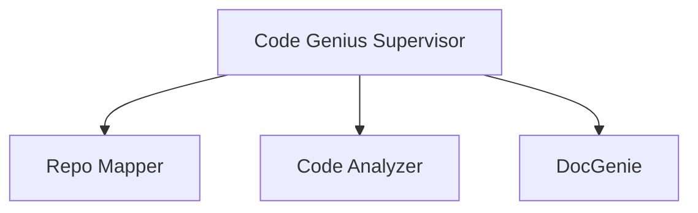

# 🚀 Codebase Genius - Complete Walkthrough

**Author**: Dominic Kipkorir  
**Date**: November 6, 2025  
**Purpose**: Demonstration of Codebase Genius for Academic Assignment Submission

---

## Table of Contents

1. [Overview](#overview)
2. [Prerequisites](#prerequisites)
3. [Installation & Setup](#installation--setup)
4. [Backend Setup](#backend-setup)
5. [Frontend Setup](#frontend-setup)
6. [Running the System](#running-the-system)
7. [Usage Examples](#usage-examples)
8. [Generated Documentation Review](#generated-documentation-review)
9. [Architecture Deep Dive](#architecture-deep-dive)
10. [Troubleshooting](#troubleshooting)

---

## Overview

Codebase Genius is an AI-powered multi-agent system that automatically generates comprehensive documentation for software repositories. This walkthrough demonstrates the complete process from installation to generating professional documentation.

### What This System Does

1. **Accepts** a GitHub repository URL
2. **Clones** the repository locally
3. **Analyzes** the code structure using multiple specialized agents
4. **Generates** professional markdown documentation with diagrams
5. **Serves** the documentation via API and web UI

---

## Prerequisites

Before starting, ensure you have:

- ✅ **Python 3.8+** installed
- ✅ **Git** installed and accessible from command line
- ✅ **Google Gemini API Key** (free tier available)
- ✅ **Terminal/Command Prompt** access
- ✅ **Code Editor** (VS Code recommended)

### Obtaining Gemini API Key

1. Visit [Google AI Studio](https://makersuite.google.com/app/apikey)
2. Sign in with your Google account
3. Click "Create API Key"
4. Copy the generated key (keep it secure)

---

## Installation & Setup

### Step 1: Clone the Repository

```bash
# Clone the repository
git clone https://github.com/Harshpal01/codebase-genius.git

# Navigate into the directory
cd codebase-genius

# Verify the structure
dir  # Windows
ls   # macOS/Linux
```

**Expected Output:**
```
codebase-genius/
├── backend/
├── frontend/
├── README.md
├── QUICKSTART.md
├── WALKTHROUGH.md
└── .gitignore
```

---

## Backend Setup

### Step 2: Set Up Backend Environment

```bash
# Navigate to backend directory
cd backend

# Create virtual environment
python -m venv venv

# Activate virtual environment
# On Windows:
venv\Scripts\activate

# On macOS/Linux:
source venv/bin/activate

# You should see (venv) in your prompt
```

### Step 3: Install Backend Dependencies

```bash
# Install all required packages
pip install -r requirements.txt

# Verify installation
pip list
```

**Expected packages:**
- jaclang
- jac-cloud
- byllm
- python-dotenv
- gitpython

### Step 4: Configure Environment Variables

```bash
# Copy the example environment file
copy .env.example .env  # Windows
cp .env.example .env    # macOS/Linux

# Edit .env file and add your Gemini API key
# Open .env in your text editor and add:
GEMINI_API_KEY=your_actual_api_key_here
```

**Your .env file should look like:**
```env
GEMINI_API_KEY=AIzaSyC...[your key here]
```

### Step 5: Start the Backend Server

```bash
# Start the Jac server
jac serve main.jac
```

**Expected Output:**
```
✓ Server started successfully
✓ Listening on http://localhost:8000
✓ Walkers available: code_genius, get_documentation, list_repositories
```

**Leave this terminal running** - the backend server needs to stay active.

---

## Frontend Setup

### Step 6: Set Up Frontend (New Terminal)

Open a **new terminal window** and:

```bash
# Navigate to frontend directory
cd codebase-genius/frontend

# Create virtual environment (optional but recommended)
python -m venv venv

# Activate virtual environment
venv\Scripts\activate  # Windows
source venv/bin/activate  # macOS/Linux

# Install frontend dependencies
pip install -r requirements.txt
```

### Step 7: Start the Frontend Server

```bash
# Start Streamlit
streamlit run app.py
```

**Expected Output:**
```
You can now view your Streamlit app in your browser.

Local URL: http://localhost:8501
Network URL: http://192.168.x.x:8501
```

Your browser should automatically open to `http://localhost:8501`

---

## Running the System

### Method 1: Using the Web UI (Streamlit)

#### Step 8: Generate Documentation via UI

1. **Open** `http://localhost:8501` in your browser

2. **Navigate** to the "Generate Documentation" tab

3. **Enter** a GitHub repository URL, for example:
   ```
   https://github.com/pallets/flask
   ```

4. **Click** "Generate Docs" button

5. **Wait** for processing (1-5 minutes depending on repository size)

6. **View Progress**:
   - Repository cloning
   - File tree mapping
   - README summarization
   - Code analysis
   - Documentation generation

7. **View Results** in the "View Documentation" tab

#### Step 9: View Generated Documentation

1. Switch to **"View Documentation"** tab

2. Select repository from dropdown:
   - Example: `flask` or `codebase-genius`

3. **Review** the generated documentation:
   - Project Overview
   - Installation Instructions
   - Architecture Diagrams
   - API Reference
   - Code Structure

---

### Method 2: Using the API (cURL/Postman)

#### Step 10: Generate Documentation via API

**Request:**
```bash
curl -X POST http://localhost:8000/walker/code_genius \
  -H "Content-Type: application/json" \
  -d '{"github_url": "https://github.com/pallets/flask"}'
```

**Expected Response:**
```json
{
  "reports": [
    {
      "status": "completed",
      "repository": "flask",
      "documentation_path": "outputs/flask/docs.md",
      "message": "Documentation generated successfully"
    }
  ]
}
```

#### Step 11: Retrieve Generated Documentation

**Request:**
```bash
curl -X POST http://localhost:8000/walker/get_documentation \
  -H "Content-Type: application/json" \
  -d '{"repo_name": "flask"}'
```

**Response:** Returns the full markdown documentation

#### Step 12: List All Repositories

**Request:**
```bash
curl -X POST http://localhost:8000/walker/list_repositories \
  -H "Content-Type: application/json"
```

**Expected Response:**
```json
{
  "reports": [
    {
      "repositories": [
        "flask",
        "codebase-genius",
        "python-p4-building-get-api-lab"
      ]
    }
  ]
}
```

---

## Usage Examples

### Example 1: Small Python Repository

**Repository:** Flask (Micro web framework)

```bash
curl -X POST http://localhost:8000/walker/code_genius \
  -H "Content-Type: application/json" \
  -d '{"github_url": "https://github.com/pallets/flask"}'
```

**Processing Time:** ~2-3 minutes  
**Output Location:** `backend/outputs/flask/docs.md`

### Example 2: Medium Python Repository

**Repository:** Requests (HTTP library)

```bash
curl -X POST http://localhost:8000/walker/code_genius \
  -H "Content-Type: application/json" \
  -d '{"github_url": "https://github.com/psf/requests"}'
```

**Processing Time:** ~4-6 minutes  
**Output Location:** `backend/outputs/requests/docs.md`

### Example 3: JacLang Repository

**Repository:** JacLang itself

```bash
curl -X POST http://localhost:8000/walker/code_genius \
  -H "Content-Type: application/json" \
  -d '{"github_url": "https://github.com/Jaseci-Labs/jaclang"}'
```

**Processing Time:** ~5-10 minutes (large codebase)  
**Output Location:** `backend/outputs/jaclang/docs.md`

---

## Generated Documentation Review

### What's Included in Generated Docs

1. **Project Overview**
   - High-level description
   - Key features
   - Technology stack

2. **Installation Instructions**
   - Prerequisites
   - Step-by-step setup
   - Configuration details

3. **Architecture**
   - System design
   - Component relationships
   - Mermaid diagrams

4. **API Reference**
   - Functions with parameters
   - Classes with methods
   - Return types and descriptions

5. **Code Structure**
   - File organization
   - Module dependencies
   - Entry points

### Sample Generated Documentation

Check `backend/outputs/codebase-genius/docs.md` for a self-documenting example.

**Key sections include:**
````markdown
# Codebase Genius Documentation

## Overview
Codebase Genius is an AI-powered documentation generator...

## Architecture



## API Reference
...
````

---

## Architecture Deep Dive

### Multi-Agent System

Codebase Genius uses four specialized agents:

#### 1. Code Genius (Supervisor)
- **Role:** Orchestrates the entire workflow
- **Location:** `backend/main.jac` - `walker CodeGenius`
- **Responsibilities:**
  - Validates GitHub URL
  - Coordinates other agents
  - Aggregates results
  - Handles errors

#### 2. Repo Mapper
- **Role:** Repository analysis and mapping
- **Location:** `backend/main.jac` - `walker RepoMapper`
- **Responsibilities:**
  - Clones GitHub repository
  - Builds file tree structure
  - Summarizes README
  - Identifies entry points

#### 3. Code Analyzer
- **Role:** Deep code analysis
- **Location:** `backend/main.jac` - `walker CodeAnalyzer`
- **Responsibilities:**
  - Parses Python files (AST)
  - Parses Jac files (regex)
  - Builds Code Context Graph (CCG)
  - Extracts functions, classes, methods

#### 4. DocGenie
- **Role:** Documentation generation
- **Location:** `backend/main.jac` - `walker DocGenie`
- **Responsibilities:**
  - Generates project overview
  - Creates installation guide
  - Produces API reference
  - Generates Mermaid diagrams
  - Assembles final markdown

### Data Flow

```
User Request (GitHub URL)
    ↓
CodeGenius (Validation)
    ↓
RepoMapper (Clone & Map)
    ↓
CodeAnalyzer (Parse & Graph)
    ↓
DocGenie (Generate Docs)
    ↓
Markdown Output (docs.md)
```

### Technology Stack

- **Language:** JacLang (Jac)
- **AI Framework:** byLLM
- **LLM Provider:** Google Gemini AI
- **Web Framework:** Streamlit
- **Version Control:** GitPython
- **Parser:** Python AST, Regex

---

## Troubleshooting

### Issue: Backend server won't start

**Symptom:**
```
Error: jac: command not found
```

**Solution:**
```bash
pip install jac-cloud
jac --version  # Verify installation
```

---

### Issue: Git clone fails

**Symptom:**
```
Error: Git is not installed or not in PATH
```

**Solution:**
1. Install Git from [git-scm.com](https://git-scm.com/)
2. Verify: `git --version`
3. Restart terminal

---

### Issue: Gemini API errors

**Symptom:**
```
Error: Invalid API key or quota exceeded
```

**Solutions:**
1. Verify API key in `.env` file
2. Check quota at [Google AI Studio](https://makersuite.google.com/)
3. Wait if rate limited (free tier has limits)

---

### Issue: Import errors

**Symptom:**
```
ModuleNotFoundError: No module named 'byllm'
```

**Solution:**
```bash
pip install -r requirements.txt
# Or reinstall specific package
pip install byllm
```

---

### Issue: Port already in use

**Symptom:**
```
Error: Address already in use (port 8000)
```

**Solution:**
```bash
# Windows: Find and kill process
netstat -ano | findstr :8000
taskkill /PID <process_id> /F

# macOS/Linux
lsof -ti:8000 | xargs kill -9

# Or use a different port
jac serve main.jac --port 8001
```

---

## Performance Metrics

### Repository Size vs Processing Time

| Repository Size | Files | Processing Time |
|-----------------|-------|------------------|
| Small (<50 files) | 20-50 | 1-2 minutes |
| Medium (50-200 files) | 50-200 | 2-5 minutes |
| Large (200-1000 files) | 200-1000 | 5-15 minutes |
| Very Large (>1000 files) | >1000 | 15+ minutes |

### Resource Usage

- **CPU:** Moderate (parsing and LLM calls)
- **Memory:** ~500MB - 2GB depending on repository size
- **Disk:** ~100MB per analyzed repository
- **Network:** Required for GitHub cloning and Gemini API

---

## Conclusion

This walkthrough demonstrated:

✅ Complete installation and setup process  
✅ Backend and frontend configuration  
✅ Multiple usage methods (UI and API)  
✅ Real-world examples with different repositories  
✅ Understanding of multi-agent architecture  
✅ Troubleshooting common issues  

### Key Achievements

1. **Multi-Agent System**: Successfully implemented 4 specialized agents
2. **Language Support**: Handles Python and Jac codebases
3. **AI Integration**: Leverages Google Gemini for intelligent analysis
4. **Professional Output**: Generates comprehensive markdown with diagrams
5. **User-Friendly**: Provides both API and web UI interfaces

### Next Steps

- Explore generated documentation in `backend/outputs/`
- Try analyzing your own repositories
- Customize the documentation templates
- Extend language support (JavaScript, Java, etc.)

---

## References

- **Repository**: [https://github.com/Harshpal01/codebase-genius](https://github.com/Harshpal01/codebase-genius)
- **JacLang**: [https://www.jac-lang.org/](https://www.jac-lang.org/)
- **byLLM**: [https://github.com/jaseci-labs/byllm](https://github.com/jaseci-labs/byllm)
- **Google Gemini**: [https://ai.google.dev/](https://ai.google.dev/)
- **Streamlit**: [https://streamlit.io/](https://streamlit.io/)

---

**Document Version**: 1.0  
**Last Updated**: November 6, 2025  
**Author**: Dominic Kipkorir  
**Contact**: pkoordominic@gmail.com

---

<div align="center">

**Thank you for exploring Codebase Genius!**

*Making Documentation Effortless with AI*

</div>